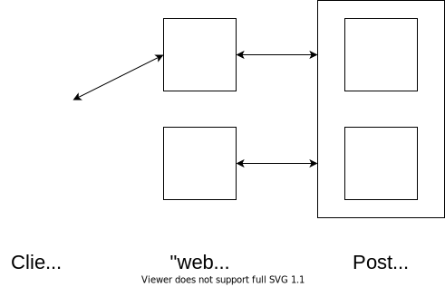

Now it's homework project, simple storage for "Product" objects. Provides RESTful API for CRUD operations and searching

#### using
`docker-compose up`

Swagger UI will be located at http://localhost:5000/ui

#### architecture
<object data='https://pastebin.com/raw/dgVVKx0b' type='image/svg'></object>

As "web" servers are stateless, they can be scaled indefinitely. System will be as consistent, as PosrgreSQL cluster. 

#### testing
For E2E tests run `docker-compose -f docker-compose.yml -f test/docker-compose.test.override.yml up test` 
Logs are handled via standard docker logging system.

#### API

All params (except path param id) could be in CGI or in json inside body

| Handle        | Parameters           | Description  |
| ------------- |:-------------| -----|
| GET /api/v1/product/{id} | <ul><li>id :int - unique identifier of the product </li></ul>| Returns json dict with fields 'id', 'name', 'category'|
| PUT /api/v1/product/{id} | <ul><li>id :int - unique identifier of the product </li><li>name :string - Human readable name </li><li>category :string - Category of the product  </li></ul>| Creates product if missing, overrides if id is already in use |
| POST /api/v1/product/{id} | Same as PUT| Same as PUT, but throws error if object already exist |
| DELETE /api/v1/product/{id} | <ul><li>id :int - unique identifier of the product </li></ul>| Removes product from database |
| GET /api/v1/products/list | All arguments are optional <ul><li>query :string - preform full-text search</li><li>category :string - limit results to single category</li><li>page :int - specifying enables pagination</li><li>per_page :int - entries on single page (default=20)</li></ul>| Returns json list of dicts with fields 'id', 'name', 'category'|
| GET /api/v1/ping | | Health check. If returned code 200, server is ready to process requests|
